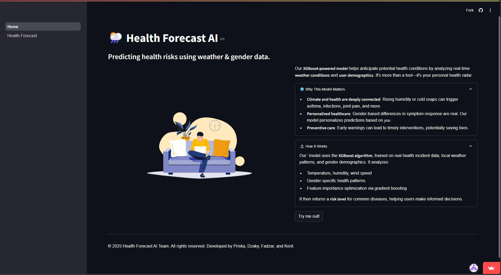

# Weather-related Disease Prediction
This dataset combines anonymized medical records (including patient symptoms and pre-existing conditions) with local weather data (temperature, humidity, wind speed) to analyze potential correlations between weather patterns and health outcomes. Sourced from secure medical databases and weather stations, the dataset covers a large and diverse cohort while maintaining strict patient privacy through de-identification. It adheres to ethical guidelines, making it a valuable resource for studying environmental impacts on health.

I am responsible in doing the machine learning classification and a little bit of dataset engineering.
# Methodology
The dataset can be found through these links:\
https://www.kaggle.com/datasets/orvile/weather-related-disease-prediction-dataset/data
https://zenodo.org/records/11366485 \
For classification, I employed XGBoost (Extreme Gradient Boosting), a powerful ensemble learning algorithm known for:
* High Accuracy: Handles complex patterns in tabular data effectively.
* Speed & Scalability: Optimized performance even on large datasets.
* Regularization: Built-in L1/L2 regularization reduces overfitting.
* Feature Importance: Provides insights into key predictors (e.g., weather variables vs. health conditions).

# Deployment
The URL for the deployment of the model can be accessed below:\
https://disease-predictor-ml.streamlit.app/

# Contributor
- Me: Classification Model and Comparison
- Revananda: Dataset Engineering
- Kent: Report and Deployment
- Priska: Report and Deployment

Research paper: \
https://docs.google.com/document/d/1fYSdDZ645Ej5ram1eEsFszlBpYSRJvXCBzDpvymCBEM/edit?usp=sharing
